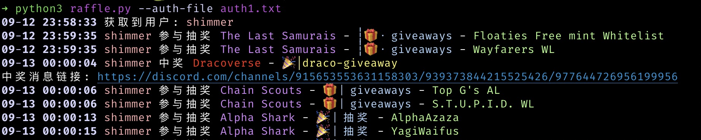

# Discord 抽奖 bot

## 功能
* 支持多用户（顺序执行，非并发，避免封号）
* 支持定时执行
* 支持设定 channel 获取中奖通知
* 可自行添加抽奖关键词

## 安装
项目借助了 discord.py 库，但因其做了限制，只适用于 bot 账户，因此对其源码进行了些许更改，需通过源码进行安装
```shell
pip3 install rich
cd discord.py && python3 setup.py install
```

## 运行
将获取到的 discord token 保存在文件中，多用户以换行作为分隔

运行 `python3 raffle.py --auth-file auth.txt` 进行一次，更多参数通过 `python3 raffle.py -h` 进行查看

运行效果：



运行完成后将在本地生成 `raffle_result.txt` 文件用于保存中奖记录及 `state_{uid}.json` 文件保存本次运行的记录。

## 风险提示 & 免责申明

Discord 并不支持使用普通账号调用相关 API，因此存在封号危险，如因使用本工具导致账号被封，后果自负。